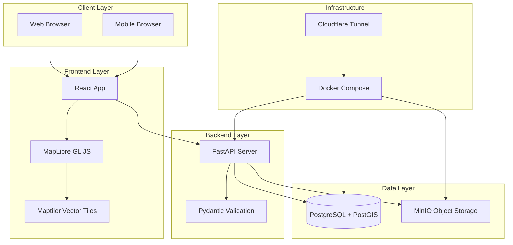

# Design Document - Sát Vách Platform

## Overview

Sát Vách là một location information sharing platform với kiến trúc map-first, cho phép users đóng góp và tìm kiếm thông tin về các địa điểm (quán ăn, cửa hàng, dịch vụ) trên bản đồ. Hệ thống được thiết kế với ba thành phần chính:

1. **Frontend (React + MapLibre GL JS)**: Giao diện người dùng với bản đồ tương tác
2. **Backend (FastAPI)**: REST API xử lý business logic và spatial queries
3. **Infrastructure (PostgreSQL + PostGIS + MinIO)**: Database với spatial extensions và object storage

Kiến trúc được tối ưu cho:
- Spatial queries hiệu suất cao với PostGIS spatial indexes
- Lazy loading locations dựa trên map viewport
- Scalability với connection pooling và caching
- Chi phí thấp với Maptiler free tier (100k loads/month) và MinIO self-hosted

## Architecture

### System Architecture



### Technology Stack

**Frontend:**
- React 18+ with TypeScript
- MapLibre GL JS for map rendering
- TailwindCSS + Flowbite for UI components
- Axios for API calls
- React Query for data fetching and caching

**Backend:**
- FastAPI (Python 3.11+)
- SQLAlchemy 2.0 for ORM
- Pydantic v2 for validation
- Alembic for migrations
- GeoAlchemy2 for PostGIS integration

**Database:**
- PostgreSQL 15+
- PostGIS 3.3+ extension for spatial data
- Spatial indexes (GIST) for performance

**Storage:**
- MinIO for S3-compatible object storage
- Image optimization with Pillow

**Deployment:**
- Docker Compose for orchestration
- Cloudflare Tunnel for secure public access
- Environment-based configuration

## Components and Interfaces

### Frontend Components

#### MapComponent
Quản lý bản đồ tương tác và hiển thị locations.

**Props:**
```typescript
interface MapComponentProps {
  center: [number, number];  // [longitude, latitude]
  zoom: number;
  locations: Location[];
  onLocationClick: (locationId: string) => void;
  onMapMove: (bounds: MapBounds) => void;
}
```

**Responsibilities:**
- Render MapLibre GL JS map với Maptiler vector tiles
- Display location markers với clustering
- Handle user interactions (pan, zoom, rotate)
- Emit events khi map viewport thay đổi
- Show user's current location

**Key Methods:**
- `loadLocations(locations: Location[])`: Add/update markers trên map
- `fitBounds(bounds: MapBounds)`: Zoom map đến bounds cụ thể
- `getUserLocation()`: Request và hiển thị vị trí user

#### LocationForm
Form để users đóng góp location mới.

**Props:**
```typescript
interface LocationFormProps {
  onSubmit: (location: LocationInput) => Promise<void>;
  initialPosition?: [number, number];
}
```

**State:**
```typescript
interface LocationFormState {
  name: string;
  description: string;
  category: Category;
  position: [number, number];
  images: File[];
  isSubmitting: boolean;
  errors: Record<string, string>;
}
```

**Responsibilities:**
- Collect location information từ user
- Validate input trước khi submit
- Handle image uploads (max 5 images, 5MB each)
- Allow position selection trên map hoặc use current location
- Display validation errors

#### LocationDetail
Hiển thị thông tin chi tiết của một location.

**Props:**
```typescript
interface LocationDetailProps {
  locationId: string;
  onClose: () => void;
}
```

**Responsibilities:**
- Fetch và display location details
- Show image gallery
- Display distance từ user's current location
- Show location trên embedded map
- Handle loading và error states

#### SearchBar
Component tìm kiếm locations.

**Props:**
```typescript
interface SearchBarProps {
  onSearch: (query: SearchQuery) => void;
  categories: Category[];
}
```

**State:**
```typescript
interface SearchQuery {
  text?: string;
  category?: Category;
  radius: number;  // meters
  center: [number, number];
}
```

**Responsibilities:**
- Text search input
- Category filter dropdown
- Radius slider (500m - 50km)
- Trigger search khi user thay đổi filters

### Backend API Endpoints

#### Location Endpoints

**POST /api/v1/locations**
Tạo location mới.

Request:
```python
class LocationCreate(BaseModel):
    name: str = Field(min_length=1, max_length=200)
    description: str = Field(min_length=1, max_length=2000)
    category: Category
    latitude: float = Field(ge=-90, le=90)
    longitude: float = Field(ge=-180, le=180)
    address: Optional[str] = None
```

Response:
```python
class LocationResponse(BaseModel):
    id: UUID
    name: str
    description: str
    category: Category
    latitude: float
    longitude: float
    address: Optional[str]
    images: List[str]  # URLs
    status: LocationStatus  # pending, approved, rejected
    created_at: datetime
```

**GET /api/v1/locations/search**
Tìm kiếm locations theo spatial query và filters.

Query Parameters:
```python
class LocationSearchParams(BaseModel):
    latitude: float
    longitude: float
    radius: int = Field(ge=500, le=50000)  # meters
    category: Optional[Category] = None
    text: Optional[str] = None
    limit: int = Field(default=100, le=500)
    offset: int = Field(default=0, ge=0)
```

Response:
```python
class LocationSearchResponse(BaseModel):
    locations: List[LocationWithDistance]
    total: int
    
class LocationWithDistance(LocationResponse):
    distance: float  # meters
```

**GET /api/v1/locations/{location_id}**
Lấy chi tiết một location.

Response: `LocationResponse`

**GET /api/v1/locations/viewport**
Lấy locations trong map viewport (lazy loading).

Query Parameters:
```python
class ViewportParams(BaseModel):
    min_lat: float
    max_lat: float
    min_lng: float
    max_lng: float
    category: Optional[Category] = None
```

Response: `List[LocationResponse]`

#### Image Endpoints

**POST /api/v1/images/upload**
Upload image cho location.

Request: `multipart/form-data` với file field

Response:
```python
class ImageUploadResponse(BaseModel):
    image_id: UUID
    url: str
    thumbnail_url: str
```

**DELETE /api/v1/images/{image_id}**
Xóa image.

Response: `204 No Content`

#### Admin Endpoints

**GET /api/v1/admin/locations**
Lấy danh sách locations cho moderation.

Query Parameters:
```python
class AdminLocationParams(BaseModel):
    status: Optional[LocationStatus] = None
    category: Optional[Category] = None
    limit: int = Field(default=50, le=200)
    offset: int = Field(default=0, ge=0)
```

Response: `List[LocationResponse]`

**PATCH /api/v1/admin/locations/{location_id}/status**
Cập nhật status của location (approve/reject).

Request:
```python
class LocationStatusUpdate(BaseModel):
    status: LocationStatus  # approved, rejected
    reason: Optional[str] = None
```

Response: `LocationResponse`

**DELETE /api/v1/admin/locations/{location_id}**
Xóa location.

Response: `204 No Content`

### Backend Services

#### LocationService
Business logic cho location management.

```python
class LocationService:
    def __init__(self, db: Session, storage: StorageService):
        self.db = db
        self.storage = storage
    
    async def create_location(
        self, 
        location_data: LocationCreate,
        images: List[UploadFile]
    ) -> Location:
        """
        Tạo location mới với validation và image upload.
        
        Steps:
        1. Validate location data
        2. Upload images to MinIO
        3. Create location record in database
        4. Set status to 'pending' for moderation
        5. Return created location
        """
        pass
    
    async def search_locations(
        self,
        params: LocationSearchParams
    ) -> Tuple[List[Location], int]:
        """
        Tìm kiếm locations sử dụng PostGIS spatial query.
        
        Steps:
        1. Build spatial query với ST_DWithin
        2. Apply category filter nếu có
        3. Apply text search nếu có (full-text search)
        4. Order by distance
        5. Apply pagination
        6. Return locations và total count
        """
        pass
    
    async def get_locations_in_viewport(
        self,
        params: ViewportParams
    ) -> List[Location]:
        """
        Lấy locations trong map viewport cho lazy loading.
        
        Steps:
        1. Build bounding box query với ST_MakeEnvelope
        2. Apply category filter nếu có
        3. Limit results để tránh overload
        4. Return locations
        """
        pass
    
    async def get_location_by_id(
        self,
        location_id: UUID
    ) -> Optional[Location]:
        """Lấy location theo ID."""
        pass
    
    async def update_location_status(
        self,
        location_id: UUID,
        status: LocationStatus,
        reason: Optional[str] = None
    ) -> Location:
        """
        Cập nhật status của location (admin only).
        
        Steps:
        1. Validate location exists
        2. Update status
        3. Log moderation action
        4. Return updated location
        """
        pass
    
    async def delete_location(
        self,
        location_id: UUID
    ) -> None:
        """
        Xóa location và associated images.
        
        Steps:
        1. Get location với images
        2. Delete images từ MinIO
        3. Delete location từ database
        """
        pass
```

#### StorageService
Quản lý image storage với MinIO.

```python
class StorageService:
    def __init__(self, minio_client: Minio):
        self.client = minio_client
        self.bucket = "location-images"
    
    async def upload_image(
        self,
        file: UploadFile,
        location_id: UUID
    ) -> Tuple[str, str]:
        """
        Upload image và tạo thumbnail.
        
        Steps:
        1. Validate file type và size
        2. Generate unique filename
        3. Optimize image (resize nếu quá lớn)
        4. Create thumbnail (300x300)
        5. Upload both to MinIO
        6. Return (image_url, thumbnail_url)
        """
        pass
    
    async def delete_image(
        self,
        image_url: str
    ) -> None:
        """Xóa image và thumbnail từ MinIO."""
        pass
    
    def get_presigned_url(
        self,
        object_name: str,
        expires: int = 3600
    ) -> str:
        """Generate presigned URL cho image access."""
        pass
```

#### SearchService
Xử lý text search và spatial queries.

```python
class SearchService:
    def __init__(self, db: Session):
        self.db = db
    
    def build_spatial_query(
        self,
        center: Tuple[float, float],
        radius: int,
        category: Optional[Category] = None
    ) -> Query:
        """
        Build PostGIS spatial query.
        
        Uses ST_DWithin for radius search:
        ST_DWithin(location.geom, ST_MakePoint(lng, lat)::geography, radius)
        
        Returns query với distance calculation.
        """
        pass
    
    def build_text_search_query(
        self,
        text: str,
        base_query: Query
    ) -> Query:
        """
        Add full-text search to query.
        
        Uses PostgreSQL tsvector:
        to_tsvector('vietnamese', name || ' ' || description) @@ 
        plainto_tsquery('vietnamese', text)
        """
        pass
    
    def build_viewport_query(
        self,
        bounds: ViewportBounds,
        category: Optional[Category] = None
    ) -> Query:
        """
        Build bounding box query.
        
        Uses ST_MakeEnvelope:
        ST_Contains(
            ST_MakeEnvelope(min_lng, min_lat, max_lng, max_lat, 4326),
            location.geom
        )
        """
        pass
```

## Data Models

### Database Schema

#### locations table
```sql
CREATE TABLE locations (
    id UUID PRIMARY KEY DEFAULT gen_random_uuid(),
    name VARCHAR(200) NOT NULL,
    description TEXT NOT NULL,
    category VARCHAR(50) NOT NULL,
    address VARCHAR(500),
    geom GEOMETRY(Point, 4326) NOT NULL,  -- PostGIS geometry
    status VARCHAR(20) NOT NULL DEFAULT 'pending',  -- pending, approved, rejected
    created_at TIMESTAMP NOT NULL DEFAULT NOW(),
    updated_at TIMESTAMP NOT NULL DEFAULT NOW()
);

-- Spatial index for performance
CREATE INDEX idx_locations_geom ON locations USING GIST(geom);

-- Index for status filtering
CREATE INDEX idx_locations_status ON locations(status);

-- Index for category filtering
CREATE INDEX idx_locations_category ON locations(category);

-- Full-text search index
CREATE INDEX idx_locations_search ON locations 
USING GIN(to_tsvector('vietnamese', name || ' ' || description));
```

#### images table
```sql
CREATE TABLE images (
    id UUID PRIMARY KEY DEFAULT gen_random_uuid(),
    location_id UUID NOT NULL REFERENCES locations(id) ON DELETE CASCADE,
    url VARCHAR(500) NOT NULL,
    thumbnail_url VARCHAR(500) NOT NULL,
    created_at TIMESTAMP NOT NULL DEFAULT NOW()
);

-- Index for location lookup
CREATE INDEX idx_images_location_id ON images(location_id);
```

#### moderation_logs table
```sql
CREATE TABLE moderation_logs (
    id UUID PRIMARY KEY DEFAULT gen_random_uuid(),
    location_id UUID NOT NULL REFERENCES locations(id) ON DELETE CASCADE,
    moderator_id VARCHAR(100),  -- For future auth integration
    action VARCHAR(50) NOT NULL,  -- approved, rejected, deleted
    reason TEXT,
    created_at TIMESTAMP NOT NULL DEFAULT NOW()
);

-- Index for audit queries
CREATE INDEX idx_moderation_logs_location_id ON moderation_logs(location_id);
CREATE INDEX idx_moderation_logs_created_at ON moderation_logs(created_at);
```

### SQLAlchemy Models

```python
from sqlalchemy import Column, String, Text, DateTime, ForeignKey
from sqlalchemy.dialects.postgresql import UUID
from sqlalchemy.orm import relationship
from geoalchemy2 import Geometry
from datetime import datetime
import uuid

class Location(Base):
    __tablename__ = "locations"
    
    id = Column(UUID(as_uuid=True), primary_key=True, default=uuid.uuid4)
    name = Column(String(200), nullable=False)
    description = Column(Text, nullable=False)
    category = Column(String(50), nullable=False)
    address = Column(String(500))
    geom = Column(Geometry('POINT', srid=4326), nullable=False)
    status = Column(String(20), nullable=False, default='pending')
    created_at = Column(DateTime, nullable=False, default=datetime.utcnow)
    updated_at = Column(DateTime, nullable=False, default=datetime.utcnow, 
                       onupdate=datetime.utcnow)
    
    # Relationships
    images = relationship("Image", back_populates="location", 
                         cascade="all, delete-orphan")
    moderation_logs = relationship("ModerationLog", back_populates="location")
    
    @property
    def latitude(self) -> float:
        """Extract latitude from geometry."""
        return self.db.session.scalar(
            func.ST_Y(self.geom)
        )
    
    @property
    def longitude(self) -> float:
        """Extract longitude from geometry."""
        return self.db.session.scalar(
            func.ST_X(self.geom)
        )

class Image(Base):
    __tablename__ = "images"
    
    id = Column(UUID(as_uuid=True), primary_key=True, default=uuid.uuid4)
    location_id = Column(UUID(as_uuid=True), ForeignKey('locations.id'), 
                        nullable=False)
    url = Column(String(500), nullable=False)
    thumbnail_url = Column(String(500), nullable=False)
    created_at = Column(DateTime, nullable=False, default=datetime.utcnow)
    
    # Relationships
    location = relationship("Location", back_populates="images")

class ModerationLog(Base):
    __tablename__ = "moderation_logs"
    
    id = Column(UUID(as_uuid=True), primary_key=True, default=uuid.uuid4)
    location_id = Column(UUID(as_uuid=True), ForeignKey('locations.id'), 
                        nullable=False)
    moderator_id = Column(String(100))
    action = Column(String(50), nullable=False)
    reason = Column(Text)
    created_at = Column(DateTime, nullable=False, default=datetime.utcnow)
    
    # Relationships
    location = relationship("Location", back_populates="moderation_logs")
```

### Pydantic Schemas

```python
from pydantic import BaseModel, Field, validator
from typing import Optional, List
from datetime import datetime
from uuid import UUID
from enum import Enum

class Category(str, Enum):
    FOOD_DRINK = "food_drink"
    SHOPPING = "shopping"
    SERVICES = "services"
    ENTERTAINMENT = "entertainment"
    HEALTHCARE = "healthcare"
    EDUCATION = "education"
    OTHER = "other"

class LocationStatus(str, Enum):
    PENDING = "pending"
    APPROVED = "approved"
    REJECTED = "rejected"

class LocationCreate(BaseModel):
    name: str = Field(min_length=1, max_length=200)
    description: str = Field(min_length=1, max_length=2000)
    category: Category
    latitude: float = Field(ge=-90, le=90)
    longitude: float = Field(ge=-180, le=180)
    address: Optional[str] = Field(None, max_length=500)
    
    @validator('name', 'description')
    def strip_whitespace(cls, v):
        """Remove leading/trailing whitespace."""
        return v.strip()

class LocationResponse(BaseModel):
    id: UUID
    name: str
    description: str
    category: Category
    latitude: float
    longitude: float
    address: Optional[str]
    images: List[str]  # URLs
    status: LocationStatus
    created_at: datetime
    
    class Config:
        from_attributes = True

class LocationWithDistance(LocationResponse):
    distance: float  # meters

class LocationSearchParams(BaseModel):
    latitude: float = Field(ge=-90, le=90)
    longitude: float = Field(ge=-180, le=180)
    radius: int = Field(ge=500, le=50000)
    category: Optional[Category] = None
    text: Optional[str] = None
    limit: int = Field(default=100, le=500)
    offset: int = Field(default=0, ge=0)

class ViewportParams(BaseModel):
    min_lat: float = Field(ge=-90, le=90)
    max_lat: float = Field(ge=-90, le=90)
    min_lng: float = Field(ge=-180, le=180)
    max_lng: float = Field(ge=-180, le=180)
    category: Optional[Category] = None
    
    @validator('max_lat')
    def validate_lat_range(cls, v, values):
        if 'min_lat' in values and v <= values['min_lat']:
            raise ValueError('max_lat must be greater than min_lat')
        return v
    
    @validator('max_lng')
    def validate_lng_range(cls, v, values):
        if 'min_lng' in values and v <= values['min_lng']:
            raise ValueError('max_lng must be greater than min_lng')
        return v

class ImageUploadResponse(BaseModel):
    image_id: UUID
    url: str
    thumbnail_url: str

class LocationStatusUpdate(BaseModel):
    status: LocationStatus
    reason: Optional[str] = Field(None, max_length=1000)
```

## Correctness Properties


*A property is a characteristic or behavior that should hold true across all valid executions of a system—essentially, a formal statement about what the system should do. Properties serve as the bridge between human-readable specifications and machine-verifiable correctness guarantees.*

### Property Reflection

After analyzing all acceptance criteria, I identified the following redundancies:

**Redundant Properties:**
- 2.2 is redundant with 2.1 (both test validation of required fields)
- 8.2 is redundant with 5.4 (both test viewport-based lazy loading)
- 10.3 is redundant with 4.4 (both test category filtering)
- 17.4 is redundant with 13.5 (both test health check endpoints)

**Combined Properties:**
- 3.2 and 3.3 can be combined into one property about image upload and storage
- 4.1, 4.3, and 4.4 can be combined into one comprehensive spatial search property

After reflection, the unique testable properties are:

### Properties

**Property 1: Location Validation**
*For any* location submission, if it lacks required fields (name, description, category, or geolocation), the system should reject it with descriptive field-specific error messages.
**Validates: Requirements 2.1, 2.5, 7.2**

**Property 2: Image Upload Limits**
*For any* location, the system should accept up to 5 images, but reject attempts to upload more than 5 images.
**Validates: Requirements 2.4**

**Property 3: Image Format and Size Validation**
*For any* image upload, if the format is JPEG, PNG, or WebP and size is ≤ 5MB, it should be accepted; otherwise it should be rejected with a clear error message.
**Validates: Requirements 3.1, 3.4**

**Property 4: Image Storage and Reference**
*For any* successfully uploaded image, it should be stored in MinIO with a unique identifier, and the location record should reference the image URL.
**Validates: Requirements 3.2, 3.3**

**Property 5: Cascade Image Deletion**
*For any* location with associated images, deleting the location should also delete all associated images from storage.
**Validates: Requirements 3.5**

**Property 6: Spatial Search Accuracy**
*For any* search with center point and radius, all returned locations should be within the specified radius, sorted by distance from the center point, and if a category filter is applied, all results should match that category.
**Validates: Requirements 4.1, 4.3, 4.4**

**Property 7: Radius Validation**
*For any* radius search, if the radius is between 500m and 50km, it should be accepted; otherwise it should be rejected.
**Validates: Requirements 4.2**

**Property 8: Marker Positioning**
*For any* set of locations loaded on the map, each location should have a marker displayed at its exact geolocation coordinates.
**Validates: Requirements 5.1**

**Property 9: Marker Click Details**
*For any* marker clicked on the map, the system should display location details including name, description, category, and thumbnail image.
**Validates: Requirements 5.2**

**Property 10: Viewport Lazy Loading**
*For any* map viewport bounds, only locations within those bounds (plus buffer) should be loaded and displayed.
**Validates: Requirements 5.4, 8.2**

**Property 11: Coordinate Precision**
*For any* stored location, the latitude and longitude should be stored with at least 6 decimal places of precision.
**Validates: Requirements 6.5**

**Property 12: Thumbnail vs Full Image Serving**
*For any* location, when displayed in list view, thumbnail images should be served; when displayed in detail view, full-size images should be served.
**Validates: Requirements 8.3**

**Property 13: Location Detail Completeness**
*For any* location detail request, the response should include name, description, category, address, and all uploaded image URLs.
**Validates: Requirements 9.1**

**Property 14: Distance Calculation**
*For any* location and user position, the calculated distance should match the great-circle distance between the two points.
**Validates: Requirements 9.3**

**Property 15: Category Requirement**
*For any* location submission, it must have exactly one category selected from the predefined list.
**Validates: Requirements 10.2**

**Property 16: Text Search Matching**
*For any* text search query, all returned locations should have the search text present in either their name or description.
**Validates: Requirements 11.1**

**Property 17: Combined Search Filters**
*For any* search with both text and spatial filters, all returned locations should match both the text query and be within the spatial radius.
**Validates: Requirements 11.4**

**Property 18: Error Response Format**
*For any* API error, the response should include an appropriate HTTP status code and a descriptive error message.
**Validates: Requirements 12.1, 12.4**

**Property 19: Input Sanitization**
*For any* user input containing potential SQL injection or XSS attack patterns, the system should sanitize the input before processing.
**Validates: Requirements 15.3**

**Property 20: Rate Limiting**
*For any* IP address, after exceeding 100 requests per minute, subsequent requests should be rejected with a 429 status code.
**Validates: Requirements 15.4**

**Property 21: Admin Location Listing**
*For any* admin panel request, all locations in the database should be displayed with their current status (pending, approved, rejected).
**Validates: Requirements 19.1**

**Property 22: Moderation Actions**
*For any* location under moderation, the system should allow approve, reject, or delete actions, and each action should update the location's status accordingly.
**Validates: Requirements 19.2**

**Property 23: Rejected Location Visibility**
*For any* rejected location, it should not appear in public search results but should remain in the database for audit purposes.
**Validates: Requirements 19.3**

**Property 24: Admin Filtering**
*For any* admin panel filter (status, category, or date), only locations matching the filter criteria should be displayed.
**Validates: Requirements 19.4**

**Property 25: Admin Detail Completeness**
*For any* location in the admin panel, all details should be displayed including images, contributor information, and submission timestamp.
**Validates: Requirements 19.5**

## Error Handling

### Error Response Format

All API errors follow a standardized format:

```python
class ErrorResponse(BaseModel):
    error: str  # Error type
    message: str  # Human-readable message
    details: Optional[Dict[str, Any]] = None  # Additional context
    timestamp: datetime
```

### Error Categories

**Validation Errors (400 Bad Request):**
```python
{
    "error": "ValidationError",
    "message": "Invalid input data",
    "details": {
        "name": ["Field is required"],
        "latitude": ["Value must be between -90 and 90"]
    },
    "timestamp": "2024-01-15T10:30:00Z"
}
```

**Not Found Errors (404 Not Found):**
```python
{
    "error": "NotFoundError",
    "message": "Location not found",
    "details": {
        "location_id": "123e4567-e89b-12d3-a456-426614174000"
    },
    "timestamp": "2024-01-15T10:30:00Z"
}
```

**Server Errors (500 Internal Server Error):**
```python
{
    "error": "InternalServerError",
    "message": "An unexpected error occurred",
    "details": None,  # No sensitive details exposed
    "timestamp": "2024-01-15T10:30:00Z"
}
```

**Service Unavailable (503 Service Unavailable):**
```python
{
    "error": "ServiceUnavailable",
    "message": "Database connection failed",
    "details": {
        "retry_after": 60  # seconds
    },
    "timestamp": "2024-01-15T10:30:00Z"
}
```

**Rate Limit Exceeded (429 Too Many Requests):**
```python
{
    "error": "RateLimitExceeded",
    "message": "Too many requests",
    "details": {
        "limit": 100,
        "window": "1 minute",
        "retry_after": 45
    },
    "timestamp": "2024-01-15T10:30:00Z"
}
```

### Error Handling Strategy

**Frontend Error Handling:**
1. Display user-friendly error messages (không expose technical details)
2. Maintain application state khi errors occur
3. Provide actionable feedback (e.g., "Please check your input")
4. Log errors to console for debugging (development only)

**Backend Error Handling:**
1. Catch all exceptions at API route level
2. Log errors với full context (stack trace, request data)
3. Return standardized error responses
4. Implement retry logic cho transient failures (storage, database)
5. Use exponential backoff cho retries

**Database Error Handling:**
1. Handle connection failures gracefully
2. Implement connection pooling với automatic reconnection
3. Return 503 Service Unavailable khi database unavailable
4. Log all database errors với query context

**Storage Error Handling:**
1. Queue failed image uploads cho retry
2. Implement exponential backoff (1s, 2s, 4s, 8s, 16s)
3. Return clear error messages khi storage unavailable
4. Clean up partial uploads on failure

## Testing Strategy

### Dual Testing Approach

The system requires both **unit tests** and **property-based tests** for comprehensive coverage:

**Unit Tests:**
- Specific examples and edge cases
- Integration points between components
- Error conditions and boundary cases
- Mock external dependencies (MinIO, database)

**Property-Based Tests:**
- Universal properties across all inputs
- Randomized input generation
- Comprehensive input coverage
- Minimum 100 iterations per property test

### Property-Based Testing Configuration

**Library:** Hypothesis (Python)

**Configuration:**
```python
from hypothesis import given, settings, strategies as st

@settings(max_examples=100)
@given(
    name=st.text(min_size=1, max_size=200),
    description=st.text(min_size=1, max_size=2000),
    category=st.sampled_from(Category),
    latitude=st.floats(min_value=-90, max_value=90),
    longitude=st.floats(min_value=-180, max_value=180)
)
def test_property_location_validation(name, description, category, latitude, longitude):
    """
    Feature: sat-vach-mvp, Property 1: Location Validation
    
    For any location submission, if it lacks required fields, 
    the system should reject it with descriptive error messages.
    """
    # Test implementation
    pass
```

### Test Organization

**Backend Tests:**
```
tests/
├── unit/
│   ├── test_location_service.py
│   ├── test_storage_service.py
│   ├── test_search_service.py
│   └── test_api_endpoints.py
├── property/
│   ├── test_location_properties.py
│   ├── test_search_properties.py
│   ├── test_image_properties.py
│   └── test_admin_properties.py
└── integration/
    ├── test_location_workflow.py
    └── test_admin_workflow.py
```

**Frontend Tests:**
```
src/
├── components/
│   ├── MapComponent.test.tsx
│   ├── LocationForm.test.tsx
│   ├── LocationDetail.test.tsx
│   └── SearchBar.test.tsx
└── services/
    ├── api.test.ts
    └── storage.test.ts
```

### Key Test Scenarios

**Unit Test Examples:**
1. Test location creation với valid data
2. Test location creation với missing required fields
3. Test image upload với valid formats
4. Test image upload với invalid formats
5. Test spatial search với known locations
6. Test category filtering
7. Test admin approval workflow
8. Test admin rejection workflow

**Property Test Examples:**
1. Property 1: Location validation với random invalid inputs
2. Property 6: Spatial search accuracy với random coordinates
3. Property 16: Text search matching với random queries
4. Property 19: Input sanitization với random malicious inputs
5. Property 23: Rejected location visibility với random locations

### Testing Tools

**Backend:**
- pytest for test runner
- Hypothesis for property-based testing
- pytest-asyncio for async tests
- pytest-cov for coverage
- Factory Boy for test data generation

**Frontend:**
- Jest for test runner
- React Testing Library for component tests
- MSW (Mock Service Worker) for API mocking
- fast-check for property-based testing (TypeScript)

### Coverage Goals

- Unit test coverage: 80%+
- Property test coverage: All 25 properties implemented
- Integration test coverage: Critical workflows (location creation, search, moderation)
- E2E test coverage: Happy paths only (optional for MVP)
