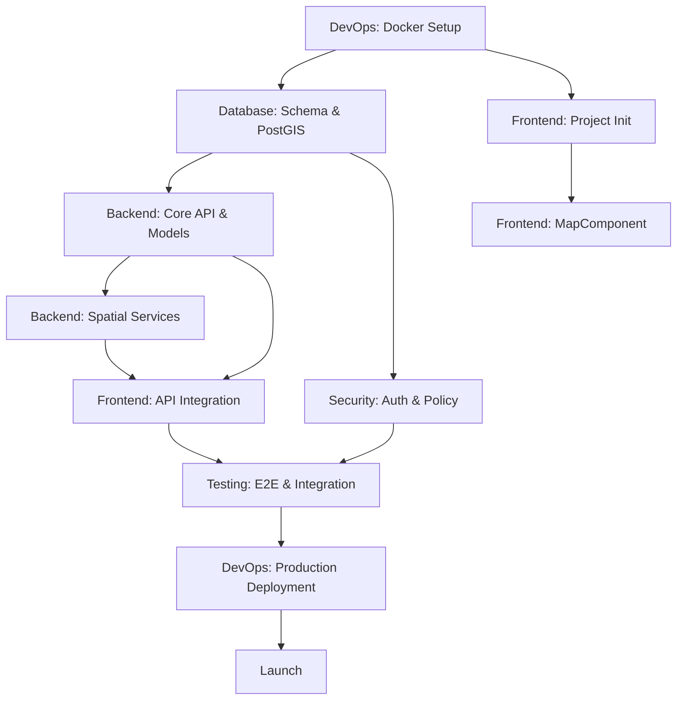

# Project Tasks Overview

## Timeline & Milestones

| Phase | Description | Duration (Est.) | Key Deliverables |
|-------|-------------|-----------------|------------------|
| **Phase 1** | Infrastructure & Database | 1-2 weeks | Docker Compose, PostGIS, MinIO running |
| **Phase 2** | Backend Core | 2-3 weeks | API endpoints, Spatial queries, Image upload |
| **Phase 3** | Frontend Core | 2-3 weeks | Map rendering, Search, Location Form |
| **Phase 4** | Integration & Testing | 1-2 weeks | E2E tests, API integration, Bug fixes |
| **Phase 5** | Production Hardening | 2-4 weeks | Auth, Monitoring, Security, Performance |
| **Phase 6** | Deployment & Launch | 1 week | Cloudflare Tunnel, Production config, Go-live |

**Total Estimated Duration**: 9-15 weeks (depending on team size and scope)

---

## Team Roles

| Role | Responsibilities | Tasks File |
|------|------------------|------------|
| **Backend Developer** | API, Services, DB Integration | [backend-tasks.md](./backend-tasks.md) |
| **Frontend Developer** | UI, Map, State Management | [frontend-tasks.md](./frontend-tasks.md) |
| **DevOps Engineer** | Docker, CI/CD, Monitoring | [devops-tasks.md](./devops-tasks.md) |
| **DBA** | Schema, Performance, Backups | [database-tasks.md](./database-tasks.md) |
| **Security Engineer** | Auth, Compliance, Auditing | [security-tasks.md](./security-tasks.md) |
| **QA Engineer** | Testing, Automation | [testing-tasks.md](./testing-tasks.md) |

> **Note**: For smaller teams, roles can be combined. One person can handle Backend + DBA, or DevOps + Security.

---

## Role-Based Task Files

-   **[Backend Tasks](./backend-tasks.md)**: FastAPI, MinIO, Services, Logging, Tracing.
-   **[Frontend Tasks](./frontend-tasks.md)**: SolidJS, MapLibre, i18n, a11y, PWA.
-   **[Database Tasks](./database-tasks.md)**: PostGIS, Alembic, Replication, PITR, GDPR.
-   **[DevOps Tasks](./devops-tasks.md)**: Docker, CI/CD, K8s, IaC, Runbooks.
-   **[Security Tasks](./security-tasks.md)**: OAuth2, 2FA, Penetration Testing, PDPA.
-   **[Testing Tasks](./testing-tasks.md)**: E2E, Contract, Chaos, Visual Regression.

---

## Dependencies & Critical Path

---

## Status Legend
- **[ ]** To Do
- **[/]** In Progress
- **[x]** Completed

---

## Phase Breakdown

### MVP Scope (Phases 1-4)
Essential for a working product:
- Map display with markers
- Location contribution form
- Radius search
- Basic moderation

### Production Scope (Phase 5)
Required for production readiness:
- Authentication (OAuth2, 2FA)
- Structured logging & tracing
- Monitoring & alerting
- Security hardening
- Performance optimization
- GDPR/PDPA compliance

### Future Enhancements
- Real-time updates (WebSocket)
- Mobile app (React Native / Capacitor)
- Advanced analytics
- Multi-language support (i18n)
